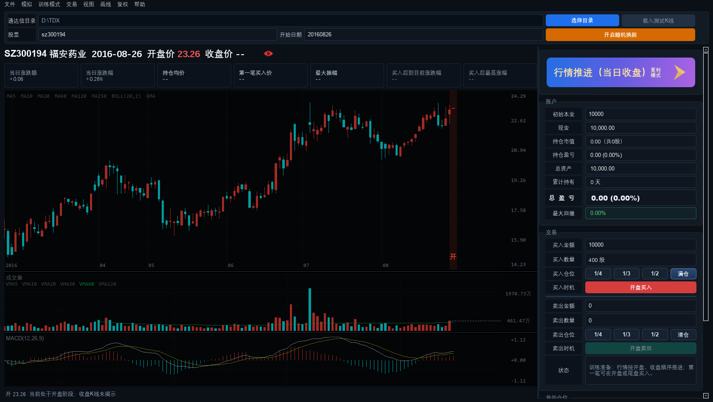

<h1 align="center">大A日K股票模拟训练器</h1>
<p align="center"><b>A-Share Kline Trainer V16</b></p>
<p align="center">V16 完整版 · Windows 10/11 · Python + PySide6</p>

> 把历史行情当成「今天」来练盘的 Windows 桌面软件：随机抽股票、随机抽日期，在看不到后续走势的情况下练买卖。
>
> A Windows desktop practice tool that treats historical bars as "today": random stock, random date, buy/sell without seeing the future.

> 关键词：日K训练、模拟炒股、通达信、A股复盘 / Keywords: a-share, kline, candlestick, trading simulator, trading practice, TDX, PySide6, China stock market

[简体中文](#界面预览) | [English](#english)

## 界面预览



## 项目简介

本软件读取本机通达信的历史日K数据（没有通达信时使用内置示例数据），隐藏选定日期之后的走势，让你用后面的K线检验自己的判断，用来训练盘感、纪律和仓位管理。

这是较早的一版（V16），只包含个股训练。带板块选股训练的新版见 [A-Share-Kline-Trainer](https://github.com/xuanxuanjushi/A-Share-Kline-Trainer)。

## 主要功能

- 随机换股、随机定位历史日期，按「年 → 月 → 日」分层随机并落在真实交易日上
- 支持手动输入股票代码和日期，或跳到最近、最早
- 日K主图加成交量、MACD 等副图；方向键平移，Ctrl+滚轮或 Ctrl+方向键缩放
- 买卖操作按 T+1 规则成交，记录资金、持仓、成本与盈亏
- 训练结束生成成绩单，历史成绩可回看并支持导出 Excel
- 续作会话：中途退出后可以继续之前的训练
- 数据备份与迁移：导出轻量数据备份（ZIP）、从备份恢复、一键生成免安装便携版
- 复权K线缓存自动维护，带容量上限，训练记录不会被自动删除

## 运行环境

- Windows 10 / 11
- Python 3.10 及以上，PySide6（源码方式运行时需要）
- 通达信行情目录（可选，没有时使用内置示例数据）

## 快速开始

源码方式，双击项目根目录的 `运行.bat`，或者：

```bat
python -m pip install -r requirements.txt
python app.py
```

启动后在「文件 → 设置」里选择通达信安装目录，即可使用本机真实行情。

## 项目结构

```
app.py                     启动入口
stock_simulator/
  app.py                   主窗口、菜单与页面
  engine.py                模拟交易引擎（成交、持仓、T+1）
  session.py               训练会话、随机换股与随机日期
  kline_widget.py          日K主图与副图绘制
  performance.py           成绩统计与历史记录
  tdx_reader.py            通达信本地数据读取
  data_migration.py        轻量备份与恢复
  portable_builder.py      生成免安装便携版
config/                    本机配置与缓存（缓存可重建）
tests/                     自动化测试
```

## 数据与缓存

- 源码模式数据目录：项目 `config` 文件夹
- 可重建缓存：`adjusted_bars_cache`、`gbbq_events`、`market_stats_daily.json`、`shanghai_index_daily.json`
- 请勿随意删除：`session_state.json`（续作会话）、`performance_history.json`（历史成绩）

## 常用快捷键

| 按键 | 作用 |
| --- | --- |
| Ctrl+F / Tab | 切换全屏 |
| Esc | 退出全屏 |
| R | 随机换股或随机定位日期 |
| 方向键 | 平移K线 |
| Ctrl+方向键 / Ctrl+滚轮 | 缩放K线 |
| B / S | 买入 / 卖出 |

## 常见问题

- **第一次打开比较慢？** 首次需要生成复权缓存，之后再启动会明显变快。
- **没有通达信数据能用吗？** 可以，软件自带示例K线，能完整体验训练流程。
- **换电脑怎么办？** 用「文件 → 数据备份与迁移」导出轻量备份，或直接生成免安装便携版文件夹。

## 免责声明

本项目只用于个人学习与交易训练，行情来自本机通达信数据或公开数据源，不构成任何投资建议。

---

## English

**A-share Daily K-line Trading Simulator (V16)** is a Windows desktop practice tool. It loads local TDX (Tongdaxin) daily data, hides everything after a chosen date, and lets you trade bar by bar as if it were the present — then scores your decisions.

This is the earlier release, focused on single-stock training. The newer version with sector-based training lives in [A-Share-Kline-Trainer](https://github.com/xuanxuanjushi/A-Share-Kline-Trainer).

### Highlights

- Random stock and random date picking (year → month → day, always landing on a real trading day)
- Daily candles with volume and MACD sub-charts, keyboard panning, Ctrl+wheel zoom
- T+1 simulated trades with cash, position, cost and P/L tracking
- Score reports after each session, reviewable history, Excel export
- Resumable sessions, lightweight ZIP backup/restore, one-click portable build

### Requirements

Windows 10/11, Python 3.10+, PySide6 (`pip install -r requirements.txt`). A local Tongdaxin directory is optional — built-in sample data is used when it is missing.

### Run

```bat
运行.bat
```

### Notes

Data lives in the local `config` folder in source mode. `adjusted_bars_cache` is rebuildable; `session_state.json` and `performance_history.json` are your records and should not be deleted.

This project is for personal study and trading practice only. It is not investment advice and it cannot place real orders.
